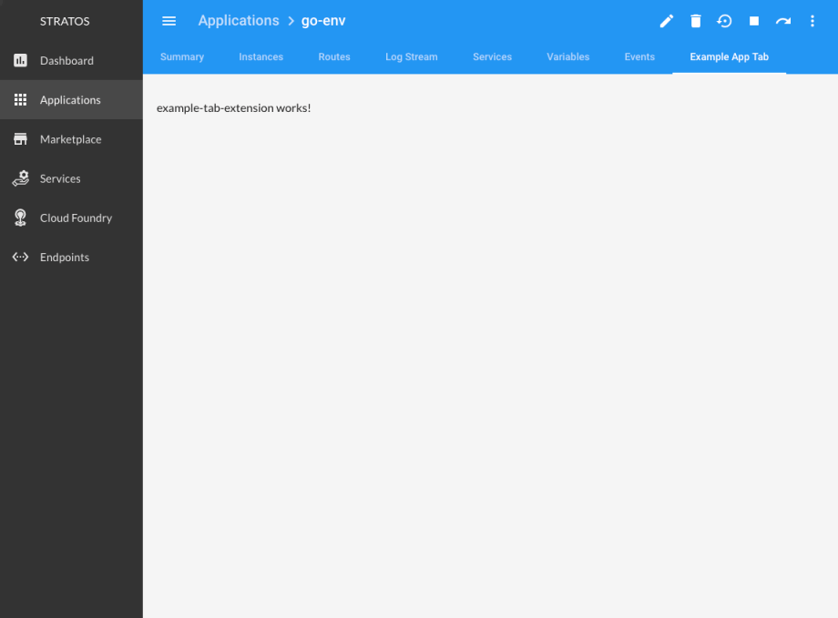

# Front-end Extensions

An example illustrating the various front-end extension points of Stratos is included in the folder `examples/custom-src`.

To include the customizations in this example, either copy or symlink the `examples/custom-src` to `custom-src` at the top-level of the Stratos repository.

Next, run the customization script (this is done automatically when you do an `npm install`) with:

```
npm run customize
```

You can now run Stratos locally to see the customizations - see the [Developer's Guide](developers-guide.md) for details.

## Example

In this example, we will walk through extending the Stratos front-end.

This walk-through assumes that you have installed the Angular CLI globally - this can be done with `npm install -g @angular/cli`.

### Create a new module

First, create the custom-src folder structure - from the top-level of the Stratos repository run:

```
mkdir -p custom-src/frontend/app/custom
mkdir -p custom-src/frontend/assets/custom
```

Next, run the customize task:

```
npm run customize
```

This will symlink our custom folder into the Stratos application source folder.

Next, use the Angular CLI to create the root module for our custom code with:

```
ng generate module custom
```

This create a new Angular module `CustomModule`.

Run the customize script again, now that that we have created the custom module with:

```
npm run customize
```

### Create a new Component for our Tab

Create a new Angular component with the CLI:

```
ng generate component custom/example-tab-extension
```

### Add Decorator to make this Component an Extension

In a text editor, open the file:

```
src/frontend/app/custom/example-tab-extension/example-tab-extension.component.ts
```

Add the following decorator to the component at the top of the file:

```
import { StratosTab, StratosTabType } from '../../core/extension/extension-service';

@StratosTab({
  type: StratosTabType.Application,
  label: 'Example App Tab',
  link: 'example'
})
```

The file should now look like this:

```
import { Component, OnInit } from '@angular/core';
import { StratosTab, StratosTabType } from '../../core/extension/extension-service';

@StratosTab({
  type: StratosTabType.Application,
  label: 'Example App Tab',
  link: 'example'
})
@Component({
  selector: 'app-example-tab-extension',
  templateUrl: './example-tab-extension.component.html',
  styleUrls: ['./example-tab-extension.component.scss']
})
export class ExampleTabExtensionComponent implements OnInit {

  constructor() { }

  ngOnInit() {
  }

}
```

Save the file.


### Mark the component as an entry component

The last thing we need to do is to mark our Extension component as an entry component.

To do this, in a text editor, open the file `src/frontend/app/custom/custom.module.ts` and add the entry components section so it looks like this:

```
@NgModule({
  imports: [
    CommonModule
  ],
  declarations: [ExampleTabExtensionComponent],
  entryComponents: [ExampleTabExtensionComponent]
})
export class CustomModule { }
```

### Run it

You should now be able to run Stratos locally and see this new tab on the application page for an application - as illustrated below:



