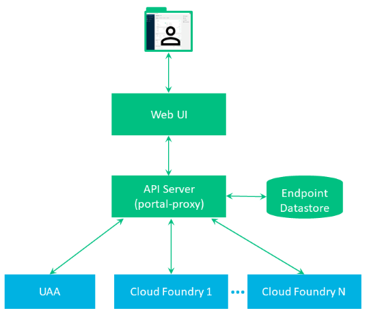

# Stratos Overview

The Stratos Console provides a web-based UI to allow developers and administrators to manage their applications and cloud foundry deployment(s).

It is designed to manage one or more Cloud Foundry deployments. It does so by managing "endpoints", where each endpoint is a reference to a Cloud Foundry deployment. The notion of an endpoint is not specific to Cloud Foundry, allowing Stratos to connect to other service types in the future.

Stratos stores endpoint metadata in a relational database. Administrators of Stratos are able to register (add) new endpoints to the Console. All users are able to then connect to these endpoints using their credentials, ensuring that they get the appropriate level of access when interacting with Cloud Foundry.

The high-level architecture of Stratos is shown in the diagram below:

The main components:

* Web UI - Single-page AngularJS web application providing the front-end that runs in the user's browser.
* API Server - Provides the back-end APIs that support the front-end UI. This API takes care of authentication, endpoint management and proxying API requests from the front-end to the desired back-end API.
* Endpoint Datastore - Relational database that stores the registered endpoints and the encrypted user access tokens.

## Authentication

Stratos UI authenticates users using a Cloud Foundry UAA service. It must be configured with the details necessary to communicate with a UAA. When the user logs in to the Console, their login will be validated with the UAA. The Console uses a scope to identify Console administrators from regular users.

Administrators use the 'Endpoints Dashboard' within the Console to add new endpoints to the Console. All users are then able to connect to these endpoints by providing their credentials. The Console will use these credentials to communicate with the UAA for the given endpoint (typically Cloud Foundry) and obtain a refresh and access token. These tokens are encrypted and stored in the Endpoint Datastore.

When a user interacts with the Console and API requests need to be made to a given Cloud Foundry endpoint, these are sent to the API Server along with a custom http header which indicated which endpoint(s) the requests should be send to. The API Server will forward the request to the appropriate endpoints, first looking up the access and refresh tokens required to communicate with the endpoint(s). If any access token has expired, it will use the refresh token to obtain a new access token.

## Deployment

Stratos UI can be deployed in a number of environments:

* Deployed in Cloud Foundry, as an application. See [guide](../deploy/cloud-foundry)
* Deployed in Kubernetes, using a Helm chart. See [guide](../deploy/kubernetes)
* Deployed in Docker, using docker compose. See [guide](../deploy/docker-compose)
* Deployed in Docker, single container deploying all components. See [guide](../deploy/all-in-one)

There are differences between the deployments as follows:

### Deployed in Cloud Foundry as an application

In this case, Stratos is deployed in a manner optimized for the management of a single Cloud Foundry instance. The 'Endpoints Dashboard' that allows multiple Cloud Foundry endpoints to be registered is not deployed. An extra component is deployed that detects that the Console is running as Cloud Foundry which does the following:

- Automatically detects the Cloud Foundry endpoint and located the UAA Endpoint to use for authentication
- Authenticates directly against the UAA for the Clound Foundry where the Console is deployed and assumes that Cloud Foundry admins are also Console admins (the UAA Scope 'cloud_controller.admin' is used to identify admins)
- Uses a SQLite database rather than Postgres
- Automatically connects to the Cloud Foundry endpoint when a user logs in to simplify the user flow when using the Console in this case

In this case, the front-end web application static resources are served by the API Server back-end rather than a separate web server.

A non-persistent SQLite database is used - by automatically registering the cloud foundry endpoint and connecting to it on login, all data stored in the database can be treated as ephimeral, since it will be re-created next time a user logs in. Cloud Foundry Session Affinity is used to ensure that when scaling up the Console Application to multiple instances, the user is also directed to the instance which will know about them and their endpoints (since each Application instance will have its own local SQLite store).

### Deployed in Kubernetes

In this case, a Helm chart is used to deploy the Console into a Kubernetes environment.

At the outer-level there are two services - the external service that provides the Console itself and a private service that provides a Postgres DB to the Console service.

The Console service is provided by a deployment consisting of two containers, one providing the static front-end web application resources, served by an nginx instance, the other providing the API Server back-end.

### Deployed in Docker using docker compose and multiple containers

In this case, Docker Compose is used to deploy the Console into Docker. The docker compose file describes 4 services:

- postgres - providing a Postgres DB for Console
- goose - to initialize the Postgres DB with the Console DB schema
- nginx - providing an nginx server that serves the front-end web application resources
- proxy - providing the back-end API Server

### Deployed in Docker using a single container

In this case, a single Docker image is run in a container that hosts all services together. SQLite is used as the database, so any endpoint metadata registered is lost when the container is destroyed.

This deployment is recommended only for trying out the Console and for development.